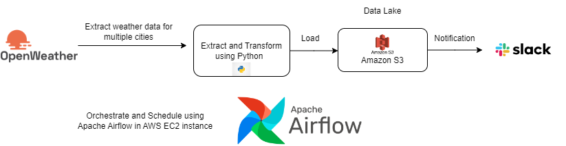
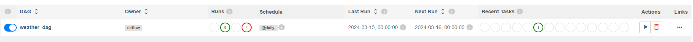
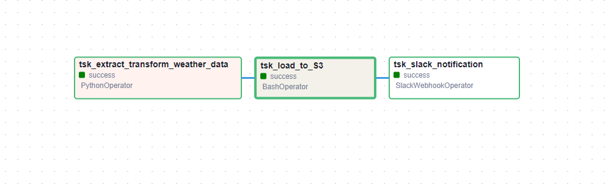
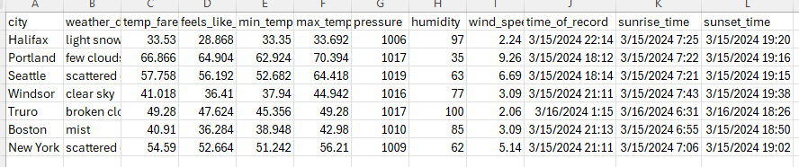
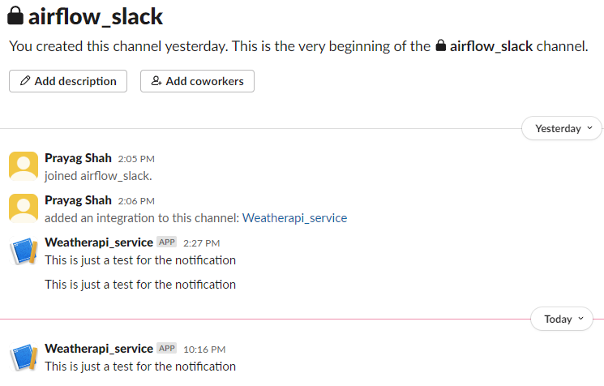

# Data Pipelines with Airflow and sending Slack Notifications

This project demonstrates how to build a data pipeline using Apache Airflow to fetch data from the OpenWeather API, perform ETL processing, and store the results in AWS S3 buckets. Additionally, it includes the integration of Slack notifications to alert the data engineering team when the pipeline is successfully executed.

## Architecture

The architecture of the data pipeline is as follows:



1. **OpenWeather API**: The pipeline starts by fetching weather data from the OpenWeather API. This data includes information such as temperature, humidity, and wind speed.

2. **ETL Processing**: Once the data is retrieved, it undergoes ETL (Extract, Transform, Load) processing. This step involves cleaning the data, performing any necessary transformations, and preparing it for storage.

3. **AWS S3 Buckets**: The processed data is then stored in AWS S3 buckets. S3 provides a scalable and durable storage solution for large datasets.

4. **Apache Airflow**: The entire pipeline is orchestrated using Apache Airflow. Airflow allows you to define and schedule workflows as directed acyclic graphs (DAGs). In this project, the DAG is responsible for executing the data retrieval, ETL processing, and data storage tasks.

5. **Slack Notifications**: To keep the data engineering team (in this case myself) informed about the pipeline's status, Slack notifications are integrated. When the pipeline successfully completes, a notification is sent to the designated Slack channel.

## Environment Setup

### Hardware Used

t2.medium EC2 instance on AWS

```
t2.medium
2 vCPUs, 4 GiB memory

```

## How to Run

Make sure airflow webserver and scheduler is running. Open the Airflow UI and enable the `weather_api` DAG. Once enabled, trigger the DAG to start the pipeline.

Store the Openweather API key in the .test.env file and then remove the .test and then save the file as .env. Once it is done then run `airflow standalone` to run the pipeline and then check the S3 bucket for the output.


OpenWeather Pipeline DAG:



DAG View:


Output in the S3 bucket:


Output in the Slack channel:



## Results

Pipelines would run daily at 7 am UTC and the results would be stored in the S3 bucket. The Slack channel would also receive a notification when the pipeline is successfully executed.

